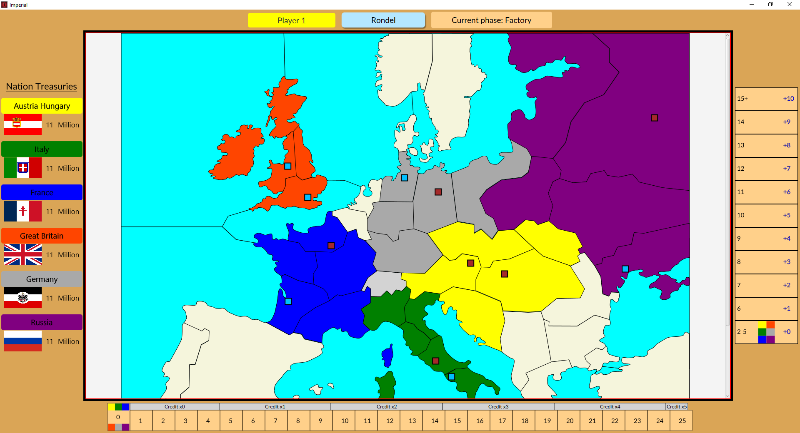
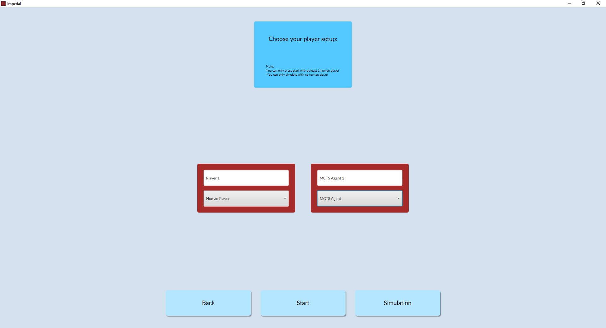
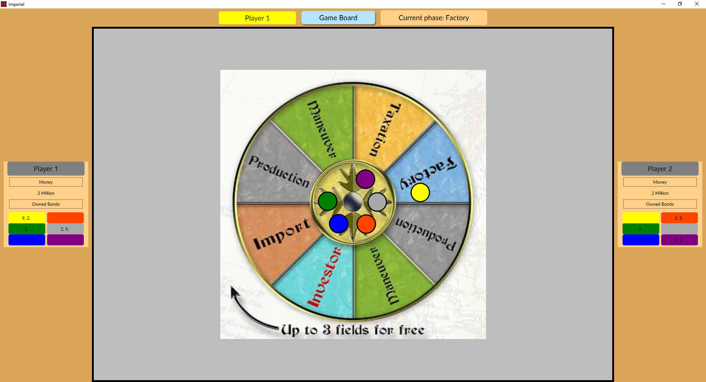

# AI-Agents-In-Imperial

This project seeks to explore the performance and dynamics of agents playing in a full Java implementation of the game [Imperial](http://bit.ly/Imperial-wiki). An array of different agent architectures are used, ranging from simple rule-based to MCTS-Deep-Neural-Network agents.

## Motivation

Imperial is a strategy game that can be played with 2 to 6 people. Players are able to rule nations and control their treasury by buying bonds, going into battles, etc. Apart from human players, this paper focuses on how AI-based search agents can play the game with the goal to find how to best address a game with an immense state space. With agents performing random and rule-based moves as a baseline, a Monte Carlo Search Tree Search agent was tested and found to be inefficient still. To prune the state space, a DeepQLearning network was then trained on the Investor action in the game and implemented into the MCTS agent as a heuristic.

I strongly recommend, before attempting to run the application, to read the rulebook for the game of Imperial which can be read [here](https://www.fgbradleys.com/rules/rules4/Imperial%20-%20Rules.pdf).

## GUI and Features

The "_Imperial_" folder of this application contains the main source code for this project's implementation (also including a readme file made around the time of the project's inception very similar to this one).

The features supported in this implementation are as follows:
- A faithful recreation within _JavaFX_ of the Imperial board game.
- The ability to play with 2, 3, or six players of any type.
- The ability to play against a few different AI agents such as:
  - A Rule-based agent designed to perform educated heuristic-led actions depending on the game-state.
  - A MCTS (Monte Carlo Tree Search [MCTS](https://en.wikipedia.org/wiki/Monte_Carlo_tree_search)) agent.
  - A Modified MCTS agent leveraging a trained Deep Q-Learning network for the state-space heavy Investor move.
  - A Random agent (mostly used as a baseline for analyzing agents).
- A "simulation" mode in which you can observe different AI agents playing against each other.
## How to Play

### How to Run and Play Our Imperial Game (For Players Only):

1. Navigate to the folder "src/main/java/Group12/launchers/" and simply run the `ImperialApplicationGUI.java` file.
2. After selecting "Start Game," you will be asked to enter the number of players. Before entering your name, you must choose that you are a "Human Player," otherwise, the name label will be reset.
   - Side note: If you want any idea of what's going on, you will need to study the Imperial rules and learn how the game is played (we offer no tutorial). _You can find the full documented rulebook [here](https://www.fgbradleys.com/rules/rules4/Imperial%20-%20Rules.pdf)_.

3. After selecting "Start," you will be greeted with the world map, and above you can read which player's turn is currently active. Along the border, you will see information about the game such as the tax chart (right), the countries and their treasuries (left), the scoring track (bottom), and the current player and phase in this turn (top).
   - Clicking and dragging will pan across the map, and zooming via the mousepad will also zoom.
4. To make a decision, you must first choose a space on the Rondel by selecting the "Rondel" button, then you may drag the corresponding player piece to the move you wish to make.
   - For example, if you move to "Factory" then return to the map screen you may click on the province you wish to build a factory, and a square should appear representing your new factory.

5. The game should progress with ease through each choice, and if an action does not end a turn in any case, pressing the "Finish Turn" button at the top of the screen should continue the game.
6. If a player won, the scores will be printed in the console.

### How to Run and Play Our Imperial Game with Agents:

**NOTICE:** There are two modes implemented for testing agents, if you wish to test a game with only agents, you must choose "Simulation" and review each of their turns by pressing the "Next tick" button (top). (A "tick" represents a turn in our implementation, a turn includes a rondel choice + whether the investor was passed).

1. Playing against an agent requires you to perform the steps as mentioned in the Human vs Human game, but simply choosing one of our agents as one of the players.
2. After making a decision as the human player, the agent should immediately respond, and you may have to go back to the game board to see what happened.
3. That's all, have fun!

I hope that this readme is informative, and that you have no issue running the game!
